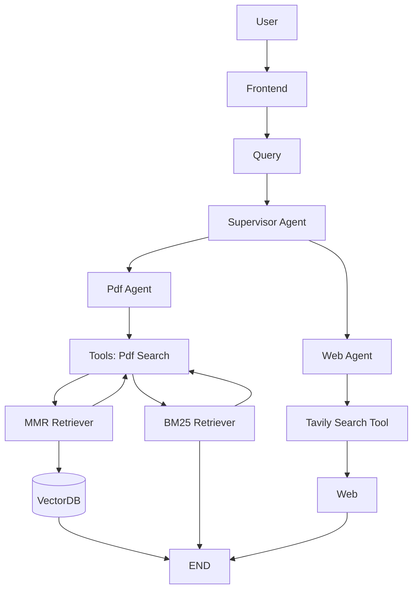
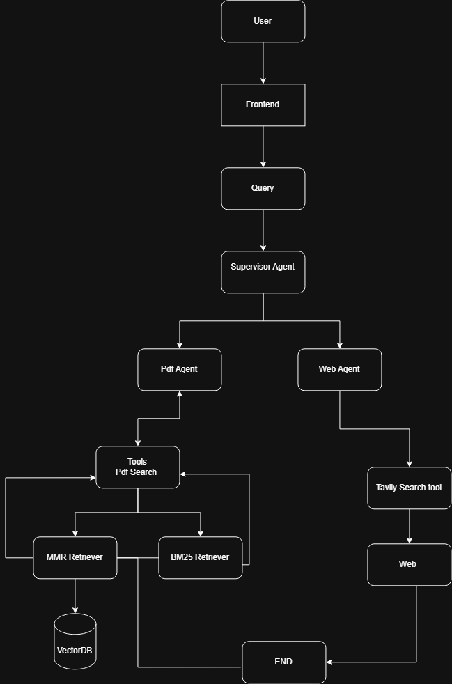

# 🤖 Multi-Agent RAG System

A multi-agent Retrieval-Augmented Generation (RAG) system that intelligently routes user queries between a **PDF Agent** and a **Web Agent**.

The system uses **LangGraph** for agent orchestration, **FAISS + BM25** for hybrid PDF retrieval, **Tavily** for web search, and a locally hosted **Qwen3:4B** model through Ollama.

---

## 🚀 Features

- 📄 **PDF Question Answering**
  - Upload a PDF and ask questions about its content.
  - Documents are split into smaller chunks for efficient retrieval.
  - Uses semantic and keyword-based retrieval.

- 🔎 **Hybrid Retrieval**
  - **FAISS** for semantic/vector similarity search.
  - **BM25** for keyword-based retrieval.
  - Combines both retrieval approaches to improve retrieval quality.

- 🌐 **Web Search Agent**
  - Uses Tavily to search the internet.
  - Handles queries requiring current or external information.

- 🧠 **Supervisor Agent**
  - Analyzes the user's query.
  - Determines whether the PDF Agent or Web Agent should handle the request.
  - Can orchestrate multiple agents in a ReAct-style workflow.

- 🔄 **LangGraph Workflow**
  - Manages communication between agents.
  - Maintains shared state and message history.
  - Supports agent → supervisor → agent loops.

- 🖥️ **Streamlit Interface**
  - Upload PDFs through a web interface.
  - Ask questions through a chat interface.
  - Displays which agent handled the query.

- 🏠 **Local LLM**
  - Uses Qwen3:4B through Ollama.
  - Main LLM inference runs locally.

---

## 🏗️ Architecture



<p align="center">
  
</p>

```text
                         USER
                           │
                           ▼
                    ┌─────────────┐
                    │  SUPERVISOR │
                    └──────┬──────┘
                           │
                 ┌─────────┴─────────┐
                 │                   │
                 ▼                   ▼
            PDF AGENT             WEB AGENT
                 │                   │
                 ▼                   ▼
          PDF Search Tool          Tavily
                 │                   │
          ┌──────┴──────┐            │
          ▼             ▼            ▼
        FAISS          BM25      Web Results
          │             │            │
          └──────┬──────┘            │
                 │                   │
                 └─────────┬─────────┘
                           ▼
                         LLM
                           │
                           ▼
                     FINAL ANSWER
